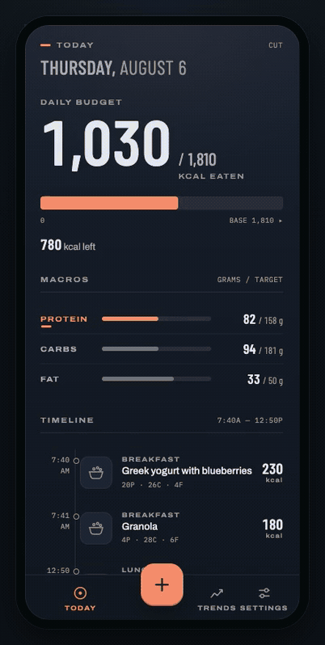

# MyMacros

Photograph your food, AI fills in the macros, and your daily calorie budget breathes with your running.

<p align="center">
  
</p>

<p align="center"><sub>
Real recording — real camera frame, real Claude call, unedited numbers. The read took 5.4s
and is sped up here; the sheet reports its own timing. Recorded with
<a href="tools/screencast.mjs"><code>tools/screencast.mjs</code></a>.
</sub></p>

<p align="center">
<a href="https://mymacros.debrief.run"><strong>mymacros.debrief.run</strong></a> — the
walkthrough: the log flow end to end, the three input modes, and what is and isn't built.
</p>

> **Status: in active development, built for one user so far.** It's deployed and the
> whole loop works end to end — photograph, scan or describe a meal and it lands in the
> timeline; the day's target moves with the runs and weigh-ins that sync in on their own;
> Trends draws a smoothed weight trend and a weekly deficit from real history. What's thin
> is everything around that: a self-hoster has to wire up their own Cloudflare account by
> hand, and nothing has been run by more than one person — [Setup](#setup) is honest about
> what that takes. **Not accepting issues or pull requests** — see
> [Contributing](#contributing).

## Architecture

One Cloudflare Worker serves the whole app: the React SPA through the assets binding, and
`/api/*` through a [Hono](https://hono.dev) router in the same script. Data lives in **D1**
(SQLite) via Kysely; meal photos live in **R2** under a `<userId>/` key prefix, where the
prefix *is* the authorization check rather than a convention on top of one. Auth is
[better-auth](https://better-auth.com) with passkeys, and Google sign-in when a
deployment configures it — no passwords anywhere, and no Google Cloud project needed to
run your own. The macros come from Claude Sonnet 5 through the Anthropic SDK: a photo or a
line of text goes in, a structured list of items with per-item confidence comes back, and
nothing is written until you've had a chance to edit it. Barcodes are decoded in-browser
and resolved against OpenFoodFacts, which needs no key.

The budget engine is the half that makes it more than a food diary, and it's built. A
target comes from Mifflin-St Jeor plus an activity factor and your goal; runs arrive from
[debrief](https://debrief.run)'s existing pipeline rather than a second Suunto OAuth, and
weight from a Garmin Index scale through that same pipeline, so the day's target moves
with what you actually did. A configurable share of run calories is eaten back, and the
earned bonus always draws as a *visible extension* of the base target rather than a
bigger number — a good day never hides where it came from.

The trap that shapes it: those activity factors describe life **excluding** purposeful
exercise. Runs are added separately, so a multiplier that already contained them would
count every mile twice — a plausible-looking budget a few hundred kcal too generous,
every day, with nothing visibly broken. That class of failure is why the project
[reconciles one real number by hand](RECONCILIATIONS.md) whenever a milestone changes how
a number is computed — production inputs pulled out, the figure recomputed independently,
and the answer deliberately not printed beside them.

Trends is real now: a smoothed weight trend, weekly intake against target, and two rates
that are allowed to disagree — one observed from the scale, one predicted from the energy
model — because pretending they reconcile is how a number stops being checkable. Weight
has a manual entry screen alongside the sync. All three theme packs render — Night
Athletic plus the Field Notes and Instrument light packs (#30) — and a service worker
precaches the shell, so the app launches without the network and Settings → App can pick
up a new build. It precaches the shell only: no API response is ever cached, so offline
you get the app and an honest failure state rather than yesterday's numbers.

No state-management library, no component library, no CSS framework — semantic design
tokens (`design/tokens.css`) and plain stylesheets. 375px (iPhone 13 mini) is the
reference width and every screen is verified there first.

## Setup

> **[install.md](install.md) is the full procedure**, written to be executed rather than
> read — every step has a check with an expected answer, so a half-finished install is
> distinguishable from a finished one. Point a coding agent at the repo and say *"follow
> install.md"*, or work through it yourself. What follows here is the short version.
>
> Don't point an agent at [CLAUDE.md](CLAUDE.md) for this — that is the maintainer's file,
> and nothing in it is needed to run your own instance.

**How updates reach your instance.** The model is two channels: pushes to `main` deploy
the maintainer's own instance and nothing else — he is the canary, and the defects no
automated check can see are the ones he finds by opening the app — while a `v*` tag
deploys every other instance, including yours. One known-good point everybody converges
on, so *the same app, run the same way* is true. Watch the repo's tags, not its commits.
`.github/workflows/deploy.yml` ships here and implements both channels; the manual
five-step version is there too. Settings → App shows which build you are running, baked
in at build time and never fetched, and its *Check for updates* button asks your own
Worker — nothing phones home.
[Keeping it updated](install.md#keeping-it-updated) is the detail.

> **Status, 2026-08-26.** The workflow is **inert** — every job is gated on a repo
> variable and none is set, so the maintainer's own instance still deploys through
> Cloudflare Workers Builds and **no `v*` tag has been cut yet**. The two channels are
> built and wired; they are not carrying traffic. This paragraph describes the model,
> and this note is here so it cannot be read as a description of today.

Local development needs **Node 22.12+** (Wrangler wants ≥22, Vite 8 wants ≥22.12) and
nothing else. D1 and R2 are emulated by miniflare, so **you do not need a Cloudflare
account until you deploy** — verified by running the steps below with an empty
`WRANGLER_HOME` and no credentials. `npm` is the package manager; `package-lock.json` is
the only committed lockfile.

```bash
git clone https://github.com/samsun076/MyMacros.git
cd MyMacros
npm install
cp .dev.vars.example .dev.vars   # do this before anything else, including cf-typegen
npm run db:migrate               # applies migrations/ to the local D1
npm run dev                      # SPA + Worker + local D1, one process
```

`GET /api/health` is the tell that it worked, and it answers two questions rather than one:

```json
{"ok":true,"db":true,"migration":"0010_run_source_neutral.sql",
 "expected_migration":"0010_run_source_neutral.sql","migration_behind":false}
```

`db:false` means the local database hasn't been migrated — run `npm run db:migrate` again.
**`migration_behind:true` means the code is newer than the database**, which is the state a
deploy that skipped its migration leaves behind: the Worker boots, the app loads, every
query answers, and then the first request touching a new column 500s. `ok` is false
whenever either is wrong, so **one curl is a complete post-deploy check**.

`npm run dev` **refuses to start if port 5173 is taken**, rather than quietly moving to
5174. That is deliberate: `APP_URL` in `.dev.vars` pins the origin, better-auth checks it,
and a dev server on a port `APP_URL` does not name fails every passkey ceremony with
`Invalid origin` — a message that says nothing about ports, ten minutes after the line
you didn't read scrolled past. Free the port, or change both together.

### ⚠️ `ALLOWED_EMAILS` refuses *everyone* when it's empty

This is the one that will waste your afternoon. `ALLOWED_EMAILS` is a comma-separated
allowlist of who may **create** an account, and **an empty or unset value refuses every
signup** — deliberately. A guard that defaulted to "allow" is exactly the hole it exists
to close: a deploy that forgot the variable would look fine and be wide open to anyone
who found the URL, spending its `ANTHROPIC_API_KEY` on their lunch.

So if sign-up silently refuses you and nothing looks broken, that's this. Put your own
address in `.dev.vars`:

```
ALLOWED_EMAILS="you@example.com"
```

Existing accounts are unaffected by changes here; it only gates creation.

### Signing in locally

*Create your account* works locally exactly as it does in production — a passkey and
nothing else, against whatever `ALLOWED_EMAILS` in your `.dev.vars` says.

The sign-in screen also carries a **dev-only email/password button**, kept because the
tooling signs in with it (`npm run verify:auth`, the screenshot matrix) and because a
password is easier to script than a WebAuthn ceremony. It's gated on
`import.meta.env.DEV`, which Vite bakes to a literal, so a production build ships with
those endpoints **refusing** and no environment variable can switch them back on.
better-auth still routes `/sign-up/email` and `/sign-in/email` either way — measured
against the built Worker, sign-up answers `EMAIL_PASSWORD_SIGN_UP_DISABLED`.

### Deploying your own

Beyond the local setup, this needs a Cloudflare account with Workers, D1 and R2 enabled:

```bash
npx wrangler login
npx wrangler d1 create mymacros-db          # paste the id into wrangler.jsonc
npx wrangler r2 bucket create mymacros-photos
```

Then set the secrets on the Worker (`npx wrangler secret put <NAME>`):
`BETTER_AUTH_SECRET`, `ALLOWED_EMAILS`, `ANTHROPIC_API_KEY`, and — if you want Google
sign-in — `GOOGLE_CLIENT_ID` and `GOOGLE_CLIENT_SECRET`.

**Google is genuinely optional, including for the first account.** Open the deployment,
tap *Create your account*, type an address `ALLOWED_EMAILS` names, and confirm with Face
ID or your fingerprint. No Google Cloud project, no OAuth consent screen. `ALLOWED_EMAILS`
is what decides who may exist here; **empty or unset refuses everyone**, so a deployment
that forgets it is shut rather than open.

The sign-up route can only ever *claim* an address that has no way in yet. Once an account
has a passkey or a linked Google login, adding another device needs a session — Settings →
Passkeys. If you lose every device you enrolled, the recovery is to delete the account's
passkey rows from your own D1 and claim it again.

Edit `wrangler.jsonc` for your own deployment: `routes` (or drop it and re-enable
`workers_dev`), and the `vars` block's `APP_URL` and `PASSKEY_RP_ID`. Then:

```bash
npm run db:migrate:remote     # ALWAYS before deploy, never after
npm run deploy
curl https://<your-host>/api/health    # ok:true means both halves landed
```

`npm run deploy` runs a **preflight** first: if a Worker of this name already exists on
the account and is bound to a *different* database, it refuses. That is the one deploy
mistake with no natural friction — `d1 create` and `r2 bucket create` both fail loudly on
a name collision, so a second instance gets renamed resources and keeps the **Worker**
name, and `wrangler deploy` then replaces instance one with exit 0 and no warning. The
first instance's data isn't deleted; it's orphaned behind a Worker that no longer points
at it, which is worse, because the app stays up and belongs to somebody else. Override
with `npm run deploy -- --force` when you mean it.

**The migrate/deploy order is load-bearing, and `.github/workflows/deploy.yml` is what
will enforce it once it is switched on.** Deploying code that expects a column the database doesn't have yet is the
quiet failure `migration_behind` exists to name; doing it the other way round is harmless,
because an unused column costs nothing. The workflow ships in this repo, runs the pair in
order, and is inert until you set the repo variables — see
[Keeping it updated](install.md#keeping-it-updated). Cloudflare Workers Builds is not an
alternative to it: it **cannot run migrations** and cannot reach a second Cloudflare
account, so it leaves the half that matters to somebody's memory. If you turn the workflow
on, turn Workers Builds off in the same sitting — two deployers pointed at one Worker
race, and which version survives is arbitrary.

Two traps worth knowing before you hit them:

- **`d1_databases[0].database_id` also names your *local* sqlite file.** Changing it
  silently repoints local dev at a fresh, empty, unmigrated database — the old one stays
  on disk under the previous id's filename. Re-run `npm run db:migrate` after you swap it.
- **A passkey's `rpID` must be the origin's host or a parent of it.** This deployment sets
  `PASSKEY_RP_ID` to a parent domain, which is why `workers_dev` is off here. If you set
  no `PASSKEY_RP_ID` at all you get the hostname as its own rpID, and passkeys work fine
  on `*.workers.dev` with no domain of your own.

### Other commands

```bash
npm run build        # typecheck + production build
npm run check        # tsc --noEmit across app, worker and node tsconfigs
npm run db:studio    # sqlite3 shell on the local D1 file
node tools/shot-matrix.mjs <file.html|url>   # 375/390/428 render matrix
```

A fresh clone signs in to an empty Today screen, which is a poor first look and
useless to screenshot. `tools/seed-demo.mjs` fills one day with a plausible morning;
`tools/screencast.mjs` and `tools/assemble-cast.mjs` are what produced the GIF above,
and between them they'll rebuild it from scratch:

```bash
node tools/seed-demo.mjs                       # a day of meals in the local D1
node tools/screencast.mjs --cookie better-auth.session_token=... \
  --video meal.y4m --at 19:20 --out shots/cast # drive and record the log flow
node tools/assemble-cast.mjs --in shots/cast --out docs/log-flow
```

The recorder needs a square `.y4m` to stand in for the camera — headless Chrome has no
camera, and its built-in fake device is a colour-bar test pattern. Any photo will do:
`ffmpeg -loop 1 -framerate 15 -i plate.jpg -t 8 -vf scale=720:720 meal.y4m`.

### Feeding the site

The same three tools produce the media on
[mymacros.debrief.run](https://mymacros.debrief.run), which is built from a **separate
repo** — the tooling lives here because it drives a running dev server with a seeded
database and a real `ANTHROPIC_API_KEY`, none of which belongs in a content repo. The
outputs are ordinary files, so the handoff is a copy.

| Site asset | Made by |
| --- | --- |
| `media/log-flow.mp4` | `screencast.mjs` → `assemble-cast.mjs` |
| `media/today-scroll.mp4` | `screencast.mjs` |
| `media/*.webp` | `shot-matrix.mjs` |

**Regenerate as a set.** `seed-demo.mjs` seeds *today* and `screencast.mjs --at` shifts
only the page's clock, so a re-recording carries a new date. The site's Today recording
announces "Thursday, August 6" in its own accessible description — replacing one clip and
not the other leaves that page contradicting itself. Same for prose: a claim like "the
day route returns no run" is invalidated by shipping a milestone, not by touching an
image, and it decays much more quietly. The cadence is a sweep at each milestone close,
alongside the theme QA that build rule 4 already mandates.

## Layout

```
src/client/   React SPA — routes/, components/, lib/
src/worker/   Hono API — index.ts (entry), auth.ts, db.ts, routes/, middleware/
src/shared/   types shared across the wire
migrations/   D1 migrations (append-only — new file per change)
design/       tokens.css (the token pack) + TOKENS.md (schema + motif slots)
sketches/     frozen design ground truth from the mockup rounds
tools/        design-QA and verification scripts
```

[PLAN.md](PLAN.md) holds the locked decisions — stack, theming, v1 scope.
[NEXT-STEPS.md](NEXT-STEPS.md) is the session playbook, and
[CLAUDE.md](CLAUDE.md) is the working brief: conventions, and a long list of things that
turned out not to be true. Work is tracked in GitHub issues, grouped by milestone.

## Contributing

**I'm not taking pull requests or issues right now.** This repo is public to be read, not
to be built by committee — it's a personal app, the architecture is still moving, and I'd
rather not accept work I can't promise to merge. Non-collaborators are blocked from
opening issues and PRs at the GitHub level, so please don't spend the effort. Forking and
doing whatever you like with it is exactly what the license is for.

## License

[MIT](LICENSE) © 2026 Dave Marcinowski
