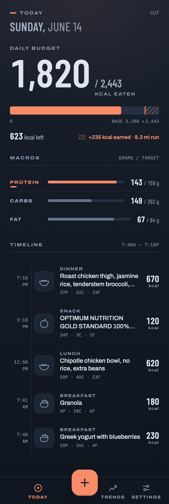

# The daily budget

*What the big number is, why there are two of them, and why running changes one and
not the other.*

## The short answer

**1,820 / 2,443** — you have eaten 1,820 kcal and today's budget is 2,443.

The budget is two numbers stacked, never one:

| | |
|---|---|
| **2,208** | your **base target** — what you eat on a day you do not run |
| **+235** | the **earned bonus** — what today's run added |

The meter draws them that way on purpose. The solid bar is your base; the hatched
section past the `BASE 2,208 ▸` marker is what the run bought you.

## Why they never merge into one number

Because "I ate 1,820 against 2,443" means two completely different things depending on
which half the 2,443 came from.

If your base is 2,443 you are eating at your planned deficit. If your base is 2,208 and
you ran 8.3 miles for the rest of it, then skipping the run tomorrow leaves you 235 kcal
over without changing a single thing you ate. One number cannot tell you which situation
you are in. Two can, at a glance, without arithmetic.

This is a standing rule in the codebase rather than a style choice — a change that merged
them would be rejected in review.

## Where the base target comes from

Your height, weight, age and sex give a resting metabolic rate. That is multiplied by
your activity level, then your chosen deficit is subtracted.

It is recomputed **fresh on every request**, from your current trend weight, so it moves
as you do. It is never a number stored from when you signed up.

**Before you have entered your details**, Today shows a card reading *Budget not set up*
and the number below it is the deployment's default — not a figure computed for you. The
card exists so the number cannot be mistaken for a real one.

## Where the earned bonus comes from

A run's calories arrive from your watch, and **half of them by default** are added to
that day's budget. That fraction is the **eat-back percentage**, and you can change it in
Settings.

Half, rather than all, because a watch's calorie estimate is itself an estimate and it
tends to read high. Eating back 100% of an over-reported burn is the ordinary way a
deficit quietly becomes maintenance.

Two things follow, and both are deliberate:

- **The bonus never touches your base target.** Take a rest day and the base is exactly
  what it was. Run twice and the base is still exactly what it was.
- **The bonus is computed per day, at the moment you look**, and never stored. There is
  no row anywhere holding "today's budget".

## What this looks like on a rest day

No run, no hatched section, no annotation. The meter draws one length and the number
after the slash *is* your base. Nothing is hidden — there is simply nothing to add.

## The one place these numbers deliberately disagree with themselves

On **Trends**, the weekly deficit uses the **full** run calories, not the half you were
allowed to eat.

That is not an inconsistency. Your budget is a plan and it uses the discounted figure
because you are hedging against the watch. Your deficit is a description of what your
body did, and your body has no opinion about your hedge. Applying the eat-back discount
in both places would apply it twice and understate every week by roughly half a run.

---

<b>Under the hood</b> — for anyone changing this

**Owning code**

| What | Where |
|---|---|
| Base target | `computeBudget` — `src/shared/budget.ts` |
| Earned bonus | `earnedKcal` — `src/shared/budget.ts` |
| Server assembly | `src/worker/routes/day.ts` (`GET /api/day/:date`) |
| Rendering | `src/client/routes/Today.tsx` + `src/client/motifs/<pack>/BudgetMeter.tsx`, `EarnedNote.tsx` |

**The rules that constrain changes here**

- **Build rule 7** (CLAUDE.md): base and earned always draw separately. `BudgetMeter` is
  built as three stacked layers and the earned layer renders even at zero width, so the
  rest-day case is the same layout with no data rather than a different layout.
- **`computeBudget` is a single source** (CLAUDE.md's register). Nothing may compute a
  base target a second time. `profiles.target_kcal` is a **write-only cache** —
  `refreshTarget` is its only writer and nothing user-facing reads it.
- **Runs are not an input to the base.** They enter only through `earnedKcal`.

**The response shape**, which is easy to get wrong: the earned figure is
`day.run.earned_kcal`, not a top-level `earned_kcal`. `run` is `null` on a rest day.

**Coverage**

- Unit: `src/shared/budget.test.ts`, `src/worker/budget.route.test.ts`.
- **No CDP drive and no component test.** `Today.tsx` is not executed by anything in
  `npm test` — the arithmetic beneath it is covered and the screen is not. Treat a green
  suite as saying nothing about this view.

**Screenshot**: `today` in `tools/doc-shots.mjs`'s manifest. `npm run docs:shots`
regenerates it. The doc day is pinned to a date carrying a run precisely so this article's
hero image shows the two-part meter; a day without one renders the case the article is not
about.

